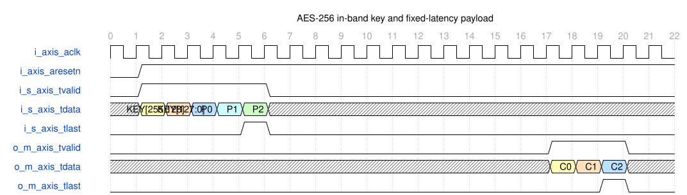

# aes256_axis_encryptor Module Specification

> RTL: `rtl/aes256_axis_encryptor.v`

## 1. Module purpose

Fully unrolled and pipelined FIPS-197 AES-256 block encryptor. Each packet carries its 256-bit key in the first two 128-bit input beats, followed by one or more 128-bit plaintext beats.

## 2. Parameters

| Parameter | Default | Description |
| --- | --- | --- |
| N/A | N/A | This module has no configurable parameters. |

## 3. Clock and reset

- Clock: `{"name": "i_axis_aclk", "edge": "posedge", "frequency": "implementation-dependent"}`
- Reset: `{"name": "i_axis_aresetn", "active": "low", "synchronous": false, "behavior": "Immediately clear all valid bits, parser state, key-schedule state, packet state, output state, and stored key material."}`

## 4. Interface signal specification

| Signal | Direction | Width | Clock domain | Semantic role | Description |
| --- | --- | --- | --- | --- | --- |
| `i_axis_aclk` | input | 1 | axis_aclk | clock | Common rising-edge clock for the input parser, key expansion, AES pipeline, and output stream. |
| `i_axis_aresetn` | input | 1 | axis_aclk | reset | Active-low asynchronous reset. Reset discards the partial key, packet state, and all in-flight ciphertext. |
| `i_s_axis_tdata` | input | 128 | axis_aclk | s_axis_tdata | In-band key and plaintext stream. The first beat is key[255:128], the second is key[127:0], and subsequent beats are plaintext blocks. |
| `i_s_axis_tvalid` | input | 1 | axis_aclk | s_axis_tvalid | Accept the current input beat on every rising edge where this signal is high. No input-ready signal exists. |
| `i_s_axis_tlast` | input | 1 | axis_aclk | s_axis_tlast | Must be low on both key beats and high only on the final plaintext beat of the packet. |
| `o_m_axis_tdata` | output | 128 | axis_aclk | m_axis_tdata | AES-256 ciphertext corresponding to an accepted plaintext beat. No outputs are generated for key beats. |
| `o_m_axis_tvalid` | output | 1 | axis_aclk | m_axis_tvalid | Ciphertext is valid on this cycle and is consumed without a ready handshake. |
| `o_m_axis_tlast` | output | 1 | axis_aclk | m_axis_tlast | Asserted with the ciphertext generated from the final plaintext beat. |

## 5. Cycle behavior and latency

- After reset or completion of the previous output packet, interpret the first valid input beat as key[255:128].
- Interpret the second valid input beat as key[127:0], completing the 256-bit FIPS-197 key. TLAST must be low on both key beats.
- Interpret every later valid beat as one independent 128-bit plaintext block under the current packet key. TLAST marks the final plaintext block.
- Input beats are accepted whenever i_s_axis_tvalid is high; there is no input TREADY signal and therefore no backpressure mechanism.
- Allow arbitrary invalid bubbles between accepted beats, including between the two key beats and between plaintext beats.
- Begin a seven-step just-in-time AES-256 round-key expansion after the second key beat. The first plaintext beat may arrive on the immediately following clock because round keys are generated ahead of the corresponding AES stages.
- Use an initial AddRoundKey register followed by fourteen fully unrolled registered AES encryption rounds.
- Accept one plaintext block per clock and emit one ciphertext block per clock after the fixed pipeline delay when input valid is continuous.
- Emit each ciphertext exactly fourteen clocks after its plaintext input beat; invalid input bubbles propagate as invalid output bubbles.
- Pipeline plaintext TLAST through the same fourteen-clock valid path so it remains aligned with its ciphertext.
- Treat an asserted output valid beat as consumed on that clock because no output TREADY signal exists.
- Do not overlap different packet keys. After accepting plaintext TLAST, ignore any further input-valid beats until the corresponding output TLAST has been emitted.
- After output TLAST, zeroize the active key schedule and return the parser to the first-key-beat state for the next packet.

## 6. WaveDrom timing diagram

### In-band key framing and one-block-per-clock AES-256 throughput

The first two valid input beats carry the high and low key halves. Three plaintext blocks follow immediately, with TLAST on P2. Ciphertexts C0 through C2 appear exactly fourteen clocks after their plaintext beats, with no TREADY signals.

- WaveJSON: [aes256_axis_encryptor_in-band-key-three-block-packet.json5](waveforms/aes256_axis_encryptor_in-band-key-three-block-packet.json5)

## 7. Boundary cases and errors

- A one-block packet consists of two key beats followed by one plaintext beat with TLAST high.
- TLAST on either key beat is a malformed packet; clear the partial packet context and treat the next valid beat as a new key-high beat.
- If the source presents input-valid data while the module is waiting for the previous output TLAST, those beats are ignored because no backpressure signal exists.
- Input-valid bubbles do not change parser order and propagate through the payload pipeline as output-valid bubbles.
- Asserting asynchronous reset during key capture, key expansion, or payload processing discards the operation and produces no completion indication.
- Because this is a raw block cipher, identical plaintext blocks under the same key produce identical ciphertext blocks.

## 8. CDC and synthesis constraints

- Generate synthesizable Verilog-2001 only.
- Implement raw AES-256 encryption exactly as specified by FIPS-197: 128-bit state, 256-bit key, 14 rounds, and 15 round keys.
- Use FIPS byte ordering: i_s_axis_tdata[127:120] is the most-significant byte of each key half or plaintext block.
- Provide no TKEEP and no TREADY ports.
- The downstream receiver must accept every cycle where o_m_axis_tvalid is high; data recovery is impossible if it cannot.
- The upstream source must keep i_s_axis_tvalid low after plaintext TLAST until the corresponding output TLAST is emitted.
- Payload steady-state initiation interval must be one clock and payload latency must be exactly fourteen clocks.
- The key-expansion path must be registered and scheduled so the first plaintext may directly follow the second key beat.
- The design provides raw block encryption only and does not implement CBC, CTR, GCM, padding, authentication, or replay protection.
- The design does not claim side-channel resistance, masking, fault detection, or constant-power behavior.

## 9. Verification and acceptance

- FIPS-197 AES-256 known-answer test: key 000102030405060708090a0b0c0d0e0f101112131415161718191a1b1c1d1e1f, plaintext 00112233445566778899aabbccddeeff, ciphertext 8ea2b7ca516745bfeafc49904b496089.
- Two consecutive key beats followed immediately by three consecutive plaintext beats produce no output for the key beats and three ordered ciphertext beats exactly fourteen clocks after their plaintext beats.
- TLAST is low on the first two output ciphertext beats and high only on the third output ciphertext beat.
- Randomized plaintext comparison against an independent AES-256 reference model for multiple packet keys.
- Random input-valid bubbles between key halves and plaintext blocks produce matching output-valid bubbles without changing block order.
- Malformed TLAST on either key beat aborts the partial key and restarts key framing without emitting ciphertext.
- Input presented during the required inter-packet drain interval is ignored and does not corrupt the in-flight output packet.
- Asynchronous reset during every parser and pipeline phase clears all output-valid state and stored key material.

## 10. Traceability

- Specification module: `aes256_axis_encryptor`
- RTL path: `rtl/aes256_axis_encryptor.v`
- Delivery requirement: this document, WaveJSON, and SVG must be published from the same specification version.
